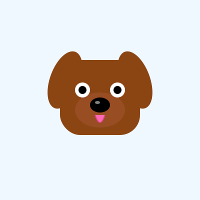

# 🐶 ForkDog

> **Your loyal digital dog that lives forever on GitHub and evolves with AI**

ForkDog is an autonomous, self-evolving digital collectible that combines:
- 🎮 **Tamagotchi-style** digital pets
- 🎨 **Genetic breeding** mechanics
- 🐶 **Adorable dog** traits
- 🤖 **AI-powered** daily evolution

## What is ForkDog?

Each ForkDog is a unique digital creature that:
- **Lives on GitHub** as a repository
- **Evolves daily** through AI-powered mutations
- **Changes appearance** based on its DNA
- **Breeds through forks** - create new generations
- **Grows a pack** across the GitHub network

### The Magic

1. **Your Dog**: The owner of the GitHub repo owns the dog
2. **Fork to Breed**: Fork the repo to create a puppy with inherited + mutated traits
3. **AI Evolution**: Every day, an AI agent slightly modifies your dog's appearance
4. **Secret DNA**: Dog traits are stored as GitHub Secrets (only you can see them)
5. **Public Art**: The dog's visual representation updates daily in the README
6. **Network Effect**: All dogs form a pack across GitHub

## How It Works

```
Day 1: 🐶 Born with random DNA
Day 2: 🐶 AI mutates fur color
Day 3: 🐶 Gets a collar
Day 4: 🐶 Expression changes
...
Day 365: 🐶 Completely unique creature

Fork it: 🐕 Puppy inherits 50% parent DNA + 50% random + daily mutations
```

## Features

### 🧬 Genetics System
- **DNA Traits**: Color, ears, accessories, expressions, patterns
- **Inheritance**: Puppies inherit traits from parents with mutations
- **Rarity System**: Some traits are rarer than others
- **Generation Tracking**: Know your dog's lineage

### ✨ Free AI Evolution
ForkDog uses **GitHub Models** (gpt-4o) by default for **free** AI-powered evolution!

- **Daily Mutations**: AI subtly evolves your dog
- **Smart Changes**: AI understands aesthetics and makes coherent changes
- **Personality Development**: Dogs develop unique personalities over time

### 🎨 Visual System
- **SVG Generation**: Procedurally generated dog art with floppy ears
- **Real-time Updates**: README shows current dog state
- **History Tracking**: See how your dog evolved over time

## Quick Start

### 1. Fork the Repository
Click the **"Fork"** button to create your own dog repository.

### 2. Enable GitHub Actions
Go to **Actions** tab and enable workflows.

### 3. Run Genesis Workflow
1. Go to **Actions** tab
2. Select **"Initialize New Dog"** from the sidebar
3. Click **"Run workflow"**
4. Your dog is being born! 🐶

### 4. Enable Daily Evolution
In **Actions** → **Daily Evolution** → **Enable workflow**

## Your Dog

<!-- DOG_DISPLAY_START -->
<div align="center">



</div>
<!-- DOG_DISPLAY_END -->

## Dog Stats

<!-- DOG_STATS_START -->
- **Generation**: 1
- **Age**: 37 days
- **Mutations**: 2
- **Rarity Score**: 16.7/100
<!-- DOG_STATS_END -->

## Family Tree

<!-- DOG_FAMILY_START -->
*Fork this repo to create puppies!*
<!-- DOG_FAMILY_END -->

## Development

```bash
pip install -r requirements.txt
python src/cli.py init
python src/cli.py evolve --ai
python src/cli.py show
```

## Inspiration

- 🎮 **Tamagotchi**: Virtual pets that need care
- 🐶 **Best Friend**: Man's loyal companion
- 🌱 **Seed-GPT**: AI-powered autonomous growth

## License

MIT License - Fork, breed, and evolve freely!

It's all free, public and uses free mechanism of Github.

---

**Your dog is unique. Your dog is loyal. Your dog is forever on GitHub.** 🐶✨
